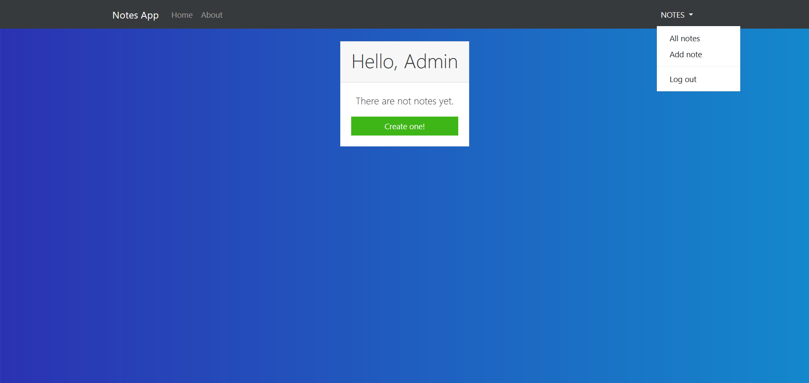
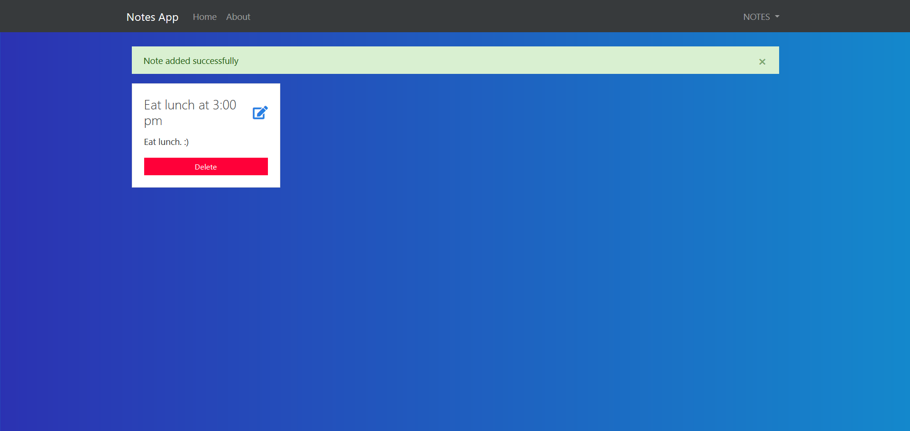

## Task creation application made in NodeJS


Remember to install the npm packages:
```
npm install
```

[Link to the application](https://notes-app-login-nodejs.herokuapp.com/)

- **Screenshots**



